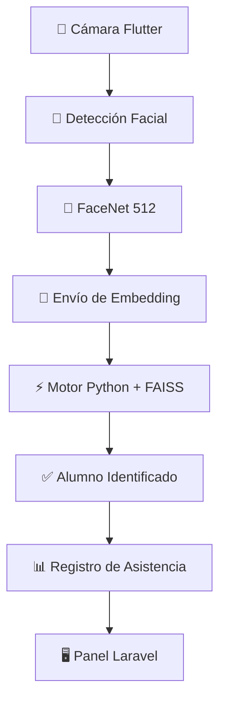

# 🎯 Smart Attendance AI

### Sistema Inteligente de Control de Asistencia mediante Reconocimiento Facial en Tiempo Real

<p align="center">
  
</p>

<p align="center">
  <b>Flutter • Python • FAISS • FaceNet512 • Laravel • MySQL</b>
</p>

---

## 🚀 Descripción General

Smart Attendance AI es un sistema automatizado de control de asistencia basado en inteligencia artificial y reconocimiento facial, diseñado para academias, institutos, universidades y centros educativos.

Su objetivo es eliminar los procesos manuales de registro, permitiendo que la asistencia se realice de forma automática, rápida y segura.

Al acercarse a la entrada, el alumno es detectado por la cámara de un dispositivo móvil, identificado mediante biometría facial y registrado automáticamente en el sistema.

---

## ⚡ Funcionamiento



---

## 🧠 Motor de Reconocimiento Facial

El sistema utiliza una arquitectura biométrica compuesta por:

* Detección facial mediante Google ML Kit.
* FaceNet 512 optimizado con TensorFlow Lite.
* Generación de embeddings faciales de alta dimensión.
* Búsqueda vectorial de alta velocidad mediante FAISS.
* Backend especializado desarrollado en Python.

Cada rostro es transformado en una representación matemática única (embedding facial), permitiendo identificar usuarios de forma eficiente incluso en bases de datos de gran tamaño.

---

## 🏗️ Tecnologías Utilizadas

### Aplicación Móvil

```yaml
Flutter
google_mlkit_face_detection: ^0.13.1
tflite_flutter: ^0.11.0
FaceNet 512 TFLite
```

### Motor Biométrico

```yaml
Python
FAISS
NumPy
OpenCV
```

### Plataforma Administrativa

```yaml
Laravel
MySQL
REST API
```

---

## ✨ Características

✅ Registro automático de asistencia

✅ Reconocimiento facial en tiempo real

✅ Gestión de alumnos

✅ Historial completo de asistencias

✅ Reportes y estadísticas

✅ Integración Flutter + Python + Laravel

✅ Arquitectura modular y escalable

---

## 📊 Flujo de Uso

1. El alumno se acerca al punto de acceso.
2. La cámara detecta el rostro.
3. Se genera el embedding facial.
4. El embedding es enviado al servidor biométrico.
5. FAISS encuentra la coincidencia más cercana.
6. Se valida la identidad del alumno.
7. La asistencia queda registrada automáticamente.

**Tiempo total de procesamiento: fracciones de segundo.**

---

## ⚠️ Nota

Este repositorio corresponde a una versión prototipo desarrollada con fines de investigación, validación tecnológica y demostración de arquitectura.

La solución permite verificar el funcionamiento integral del reconocimiento facial, la identificación biométrica y el registro automatizado de asistencia.

---

# 🔬 Versión Profesional

Además de este prototipo, se dispone de una versión más avanzada desarrollada tras múltiples etapas de investigación, pruebas y optimización.

Entre las mejoras implementadas destacan:

* Mayor precisión biométrica.
* Reducción significativa de falsos positivos.
* Mejor rendimiento en escenarios reales.
* Algoritmos de comparación más robustos.
* Arquitectura optimizada para grandes volúmenes de usuarios.
* Tecnologías de reconocimiento facial de última generación.

Instituciones o empresas interesadas en una implementación de nivel profesional pueden solicitar información adicional.

---

## 👨‍💻 Autor

**Ing. Raúl Gabriel Hacho**

Desarrollador de software e investigador en inteligencia artificial aplicada a sistemas de identificación biométrica y automatización de procesos.

⭐ Si este proyecto te resulta útil o interesante, considera dejar una estrella al repositorio.

---

## 📬 Contacto

¿Interesado en una versión más avanzada o en una implementación para tu institución?

### Consultas comerciales y colaboraciones
📧 Email: [rg.raul200@gmail.com](mailto:rg.raul200@gmail.com)

---

### Soluciones Personalizadas

También se desarrollan soluciones a medida para instituciones educativas, empresas y organizaciones que requieran sistemas biométricos, automatización de asistencia o integración de inteligencia artificial en sus procesos.
